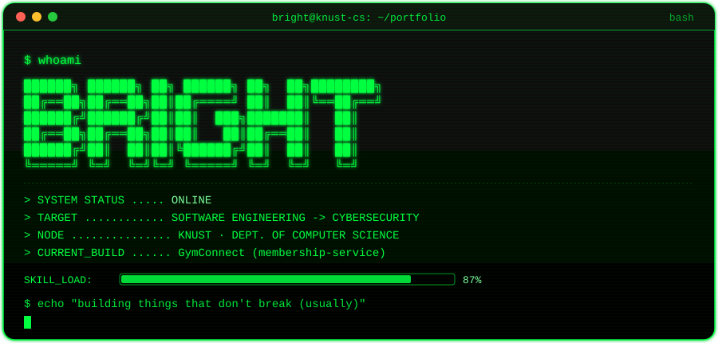

<div align="center">



</div>

<div align="center">


</div>

<div align="center">


</div>

<br>

```ansi
[32m┌──────────────────────────────────────────────────────────┐[0m
[32m│[0m [32m$ cat about_me.txt[0m
[32m│[0m
[32m│[0m [32m> Computer Science student at KNUST, moving from[0m
[32m│[0m [32m  software engineering into cybersecurity.[0m
[32m│[0m [32m> Comfortable across the stack: backend services,[0m
[32m│[0m [32m  databases, low-level systems, and enterprise apps.[0m
[32m│[0m [32m> Currently reverse-engineering how systems break[0m
[32m│[0m [32m  so I can learn how to defend them.[0m
[32m│[0m
[32m└──────────────────────────────────────────────────────────┘[0m
```

### `> ls ./skills`

<div align="center">


</div>

### `> ls ./projects`

```text
drwxr-xr-x   bright  staff   GymConnect/
├── membership-service/      # core service I built — monorepo, Spring Boot
├── ...other-services/
└── README.md
```

<div align="center">

<a href="#">

</a>

</div>

> **Note:** Replace `YOUR_GITHUB_USERNAME` above (and in the stats section below) with your actual GitHub handle for the card to render.

### `> ./run_diagnostics.sh --github-stats`

<div align="center">


</div>

### `> whoami --verbose`

```ansi
[32mname[0m     : Bright
[32mnode[0m     : KNUST — Dept. of Computer Science
[32mtrack[0m    : Software Engineering -> Cybersecurity
[32mstack[0m    : SQL / T-SQL · Java · Spring Boot · VB.NET · x86 ASM
[32mstatus[0m   : [ONLINE]
```

<div align="center">

<sub>█ terminal session active · connection secure · last login: today █</sub>

</div>
